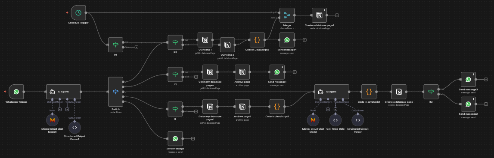

# Sistema de automatización de turnos laborales con IA

Sistema de automatización que procesa turnos laborales enviados por WhatsApp, aplica reglas de negocio (festivos y domingos), calcula el valor del turno y sincroniza la información en una base estructurada.

## Problema

La información de turnos laborales se recibe por WhatsApp en mensajes no estructurados, lo que dificulta llevar un control claro de fechas, valores y pagos acumulados. Los errores manuales generan confusión y pérdida de tiempo al momento de calcular el total de una quincena.

## Solución

Se diseñó un flujo automatizado que recibe mensajes reenviados a un bot de WhatsApp, interpreta su contenido mediante inteligencia artificial y detecta la intención del usuario. El sistema valida si el mensaje corresponde a la creación, edición o eliminación de un turno laboral, extrae la información relevante y aplica reglas de negocio para calcular el valor del turno, manteniendo los datos sincronizados en una base estructurada.

## Arquitectura

1. El mensaje de asignación de turno es reenviado a un bot de WhatsApp.
2. n8n recibe el mensaje y ejecuta un primer agente de IA que analiza la intención del contenido.
3. Según la intención detectada (crear, editar o eliminar turno), el flujo dirige el mensaje al camino correspondiente.
4. En el caso de ediciones o eliminaciones, el sistema utiliza la referencia al mensaje original (reply) para correlacionar la acción con el turno previamente registrado.
5. Se aplican reglas de negocio (domingos y festivos) y se sincroniza la información en una base estructurada.

## Manejo de intención y correlación de mensajes

El sistema utiliza un enfoque basado en intención para interpretar las acciones del usuario. Todo flujo inicia con un mensaje de asignación de turno, el cual actúa como referencia principal.

Para modificar o eliminar un turno, el usuario responde directamente a ese mensaje indicando la acción deseada. El flujo extrae el identificador del mensaje original y lo utiliza para localizar y actualizar el registro correspondiente en la base de datos.

Este enfoque permite mantener consistencia lógica sin depender de eventos automáticos de edición o eliminación del proveedor de mensajería.

## Flujo de automatización

El flujo de n8n centraliza la lógica del sistema, gestionando la interpretación de mensajes, aplicación de reglas y sincronización de datos.

## Tecnologías

- n8n
- JavaScript
- IA (Mistral API)
- WhatsApp Bot
- Notion API

## Limitaciones

- La integración con WhatsApp depende del reenvío manual de mensajes al bot.
- Las ediciones o eliminaciones de turnos requieren responder al mensaje original para mantener la correlación.
- El sistema no está desplegado como producto comercial.
- El flujo está diseñado para un volumen moderado de mensajes.

## Estado del proyecto

El sistema es funcional y ha sido validado en un caso real. Actualmente se encuentra en evolución, con foco en mejorar la automatización del canal de entrada y el despliegue del flujo.
